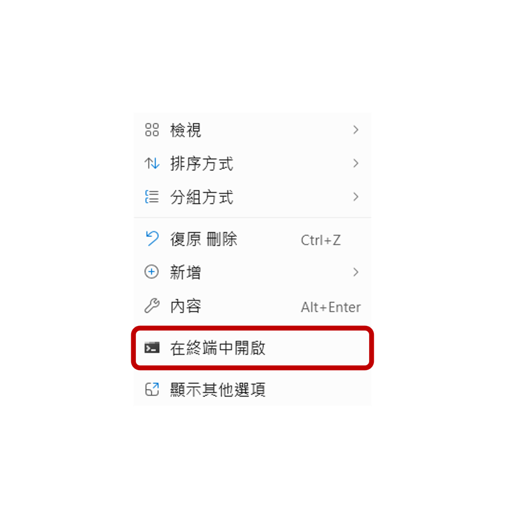
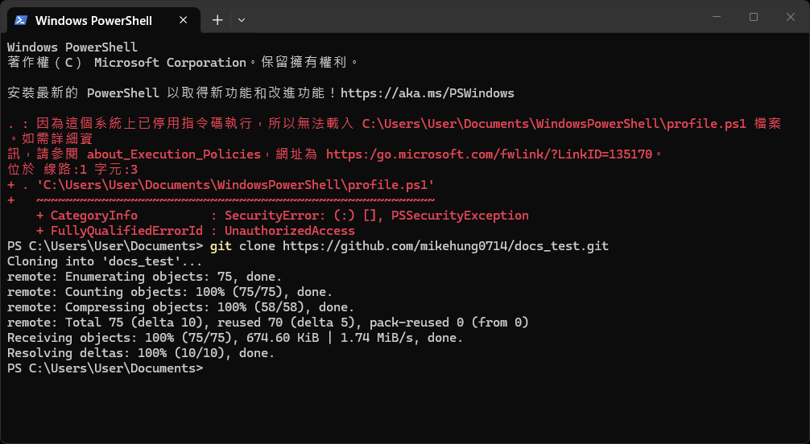

# 前置作業

:::warning
適用於windows環境
:::

## 需要先安裝
Node.js

Git

Visual Studio Code(建議)

## 複製專案框架
先在檔案總管選一個位置用來放專案，例如桌面或 D 槽等等。

在空白處按右鍵選 `在終端中開啟`。


在終端右鍵貼上
```bash
git clone https://github.com/mikehung0714/docs_test.git
```


## 安裝專案套件
複製完成後，用 VSCode 開啟專案資料夾。

打開專案後，在 VSCode 上方選單選：

```text
Terminal → New Terminal
```
下方會出現終端機。

第一次使用需要安裝套件，在終端右鍵貼上
```bash
npm install
```