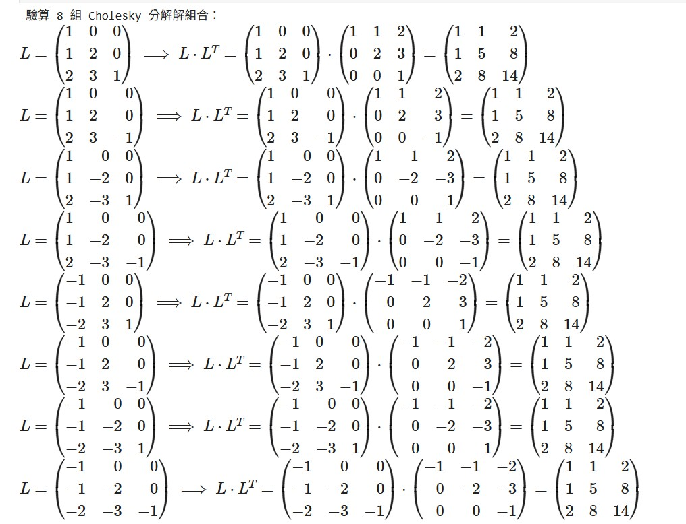

# 前置作業

:::warning
適用於windows環境
:::

## 需要先安裝
Node.js

Git

Visual Studio Code(建議)

## 複製專案框架
先在檔案總管選一個位置用來放專案，例如桌面或 D 槽等等。

在空白處按右鍵選 `在終端中開啟`。


在終端右鍵貼上
```bash
git clone https://github.com/mikehung0714/docs_test.git
```


## 安裝專案套件
複製完成後，用 VSCode 開啟專案資料夾。

打開專案後，在 VSCode 上方選單選：

```python 

# 1. 定義原始矩陣 A
A = matrix(QQ, [[1, 1, 2], [1, 5, 8], [2, 8, 14]])

# 2. 定義基礎 L 矩陣
L_base = matrix(QQ, [[1, 0, 0], [1, 2, 0], [2, 3, 1]])

print("驗算 8 組 Cholesky 分解解組合：")

# 3. 使用迴圈產生 8 組組合並漂亮顯示
count = 1
for s1 in [1, -1]:
    for s2 in [1, -1]:
        for s3 in [1, -1]:
            # 依據符號組合調整列 (Column)
            L = matrix(QQ, 3, 3)
            L.set_column(0, L_base.column(0) * s1)
            L.set_column(1, L_base.column(1) * s2)
            L.set_column(2, L_base.column(2) * s3)
            
            # 使用 html 漂亮顯示： L * L^T = 結果
            html(f"第 {count} 組解：")
            # latex(L) 會將矩陣轉換為 LaTeX 語法，show() 則負責渲染
            pretty_print(html(r"$L = %s \implies L \cdot L^T = %s \cdot %s = %s$" % 
                        (latex(L), latex(L), latex(L.transpose()), latex(L * L.transpose()))))
            count += 1


Terminal → New Terminal
```



下方會出現終端機。
第一次使用需要安裝套件，在終端右鍵貼上
```bash
npm install
```